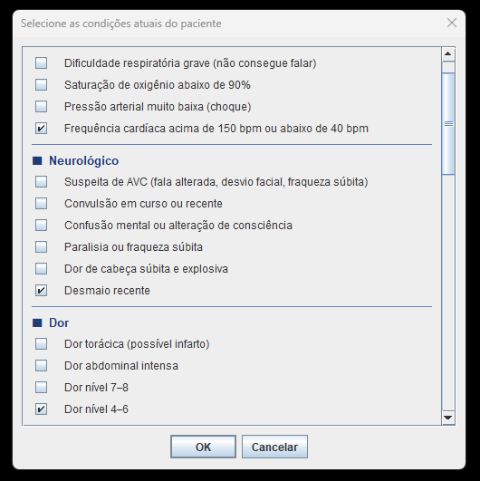
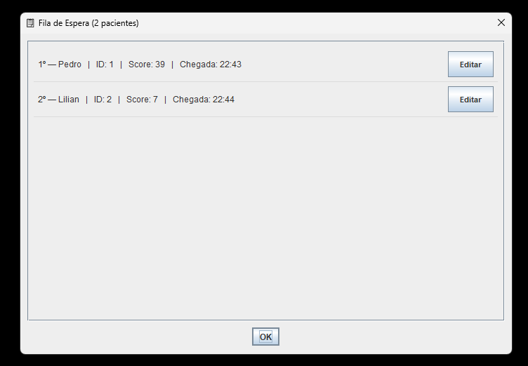
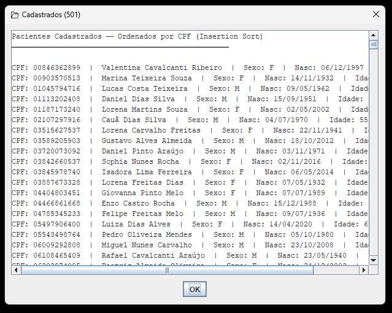
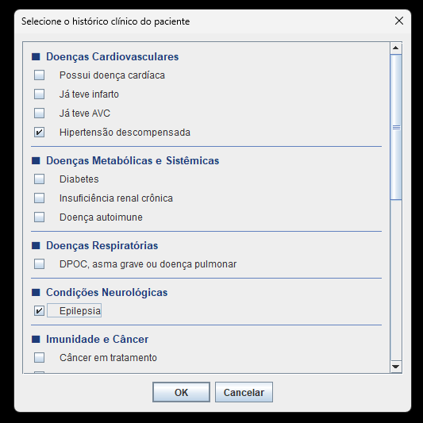
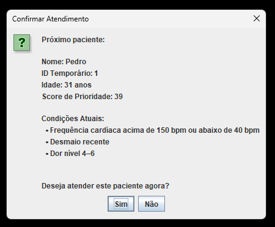

# Sistema de Triagem Hospitalar - EDA2

## Objetivo do Projeto
O objetivo deste projeto é implementar um sistema de triagem de pacientes para atendimento hospitalar de emergência. O sistema utiliza uma **Fila de Prioridade estruturada em MaxHeap** para garantir que os casos mais graves sejam atendidos primeiro, simulando a tomada de decisão clínica em tempo real com base em uma taxonomia de riscos e sintomas.

## Características dos Dados e Arquitetura

* **Score de Prioridade Dinâmico:** A ordem de atendimento não é por ordem de chegada, mas sim pelo risco de morte. O Score é calculado matematicamente somando a gravidade dos domínios clínicos: Sintomas Agudos (visita atual) e Histórico Clínico (banco de dados), aliados a um cálculo de risco por faixa etária. Pacientes mais graves sobem para a raiz da árvore (posição 0).
* **Fila de Espera (MaxHeap):** Estrutura de dados com complexidade $O(\log N)$ para inserção (Shift-Up) e remoção (Shift-Down), garantindo altíssima performance mesmo com uma sala de espera lotada.
* **Cadastro e Busca Rápida:** O banco de dados fixo do hospital (cadastro de pacientes) é ordenado pelo CPF utilizando **Insertion Sort**. Isso permite que o sistema identifique os dados do paciente instantaneamente na recepção utilizando **Busca Binária** com complexidade $O(\log N)$.
* **Persistência em Arquivo:** Os dados fixos são salvos e carregados de um arquivo `pacientes.csv` utilizando um serviço próprio de manipulação de Strings e conversão de Enums.

## 🧬 Gerador Probabilístico de Pacientes (Massa de Dados)

Para simular um ambiente hospitalar realista e estressar o sistema com dados fidedignos, o projeto conta com um gerador avançado escrito em Java (`util/GeradorPacientes.java`) capaz de criar instantaneamente centenas de registros.

**Diferenciais do Gerador:**
* **Realismo Epidemiológico:** O algoritmo não distribui doenças de forma puramente aleatória. Ele utiliza probabilidade ponderada por faixa etária (ex: pacientes com mais de 60 anos têm incidência muito maior de Hipertensão e Doenças Cardíacas, enquanto crianças recebem condições pediátricas específicas).
* **Validação de Documentos:** Gera CPFs 100% válidos matematicamente (através do cálculo oficial dos Dígitos Verificadores em módulo 11).
* **Nomes Brasileiros Reais:** Combina listas extensas de nomes e sobrenomes comuns no Brasil, evitando redundâncias irreais (como "Silva Silva").
* **Otimização de Performance para o Insertion Sort:** Antes de exportar para o arquivo `pacientes.csv`, o gerador já ordena a lista de pacientes por CPF. Isso garante que, ao iniciar o sistema principal, a carga inicial na memória opere no seu melhor caso matemático ($O(N)$).

## Divisão de Responsabilidades

Conforme a evolução do projeto e a arquitetura adotada, o desenvolvimento foi fatiado da seguinte maneira:

### Davi
* Estruturação e algoritmo do motor de Fila de Prioridade (**MaxHeap**).
* Taxonomia clínica em domínios isolados (`HistoricoClinico` e `CondicaoAtual`).
* Gerador Probabilístico de Pacientes

### Mateus
* Idealização do sistema de pesos e gravidade clínica (Inspirado no Protocolo de Manchester).
* Implementação dos algoritmos utilitários do pacote de estruturas (**Busca Binária** e **Insertion Sort**).
* Implementação do motor de persistência de dados (`PersistenciaService`).
* Construção de toda a interface gráfica modularizada em Java Swing.
* Sistema de cadastro dos pacientes

### Responsabilidade Compartilhada
* Refatoração contínua e aplicação de princípios de Clean Code (como SRP - Single Responsibility Principle).
* Integração dos serviços do backend com a interface gráfica.

## 💻 Como Executar

A aplicação foi desenhada para rodar de forma leve e direta. Como o arquivo de banco de dados (`pacientes.csv`) foi omitido do repositório por questões de versionamento, você precisará gerá-lo localmente antes da primeira execução.

**Pré-requisitos:** JDK 25 ou superior.

1. Clone o repositório e abra o projeto na sua IDE de preferência (IntelliJ IDEA, Eclipse, VS Code).
2. Certifique-se de que a pasta `src/` está marcada como o diretório de fontes (*Sources Root*).
3. **Passo 1 - Gerar a Massa de Dados:**
   * Navegue até o arquivo `src/util/GeradorPacientes.java`.
   * Execute a classe `GeradorPacientes`.
   * O console informará a conclusão, e o arquivo `pacientes.csv` será criado na **raiz do projeto**.
4. **Passo 2 - Iniciar o Sistema Hospitalar:**
   * Navegue até o arquivo `src/Main.java`.
   * Execute a classe `Main`. O sistema carregará a massa de dados para a memória ordenando os CPFs automaticamente, e inicializará a Interface Gráfica de Atendimento.

## 🎥 Demonstração Visual

**Assista ao nosso vídeo explicativo no YouTube:** 

### Capturas de Tela do Sistema

<b>🖼️ Clique para expandir as imagens do sistema</b>

 

    
    
    
    
  

## Equipe de Desenvolvimento

|  **Davi Freitas** |  **Mateus Barreto** |
| :---: | :---: |
| Matrícula: **241011018** | Matrícula: **241011466** |
|  [`@Davi-UnB`](https://github.com/Davi-UnB) |  [`@Mateus0xC`](https://github.com/Mateus0xC)